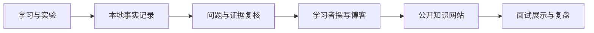

网站已上线 · Day 01 博客待学习者撰写

## 这个网站记录什么

  

    <h3>学习过程</h3>
    
路线、每日学习日志、UE 知识地图、问题复盘和面试表达。

  

  

    <h3>工程作品</h3>
    
Project Aegis、系统设计、功能证据、演示视频和版本演进。

  

  

    <h3>深度能力</h3>
    
GAS、网络、性能、资源、测试以及 Lyra / UE 源码阅读。

  

## 内容形成方式

网站只公开经过验证且适合展示的内容。私有凭据、前公司内部信息、许可不明确的资产和大型原始视频不会进入仓库。
