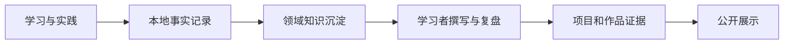

当前主线：UE 客户端工程 · Project Aegis

## 知识领域

  <a class="portfolio-card" href="/ue/">
    <h3>UE 客户端工程</h3>
    
构建系统、Gameplay、GAS、AI、网络、资源、测试、性能与源码阅读。

  </a>
  <a class="portfolio-card" href="/ai/">
    <h3>AI / 机器学习与大模型</h3>
    
数学基础、机器学习、深度学习、LLM、Agent、RAG 与实验项目。

  </a>
  <a class="portfolio-card" href="/concurrency/">
    <h3>C++ 多线程与并发</h3>
    
内存模型、同步原语、锁与无锁结构、任务、协程、调试与性能测试。

  </a>
  <a class="portfolio-card" href="/photography/">
    <h3>摄影</h3>
    
曝光、构图、用光、色彩、后期工作流与摄影作品。

  </a>
  <a class="portfolio-card" href="/writing/">
    <h3>文学阅读与写作</h3>
    
阅读笔记、叙事、人物、视角、语言、写作练习与作品复盘。

  </a>
  <a class="portfolio-card" href="/projects/">
    <h3>项目与作品</h3>
    
跨领域聚合工程项目、实验、摄影作品和文学创作。

  </a>

## 内容形成方式

网站只公开经过验证且适合展示的内容。私有凭据、前公司内部信息、许可不明确的资产和大型原始媒体不会进入仓库。
