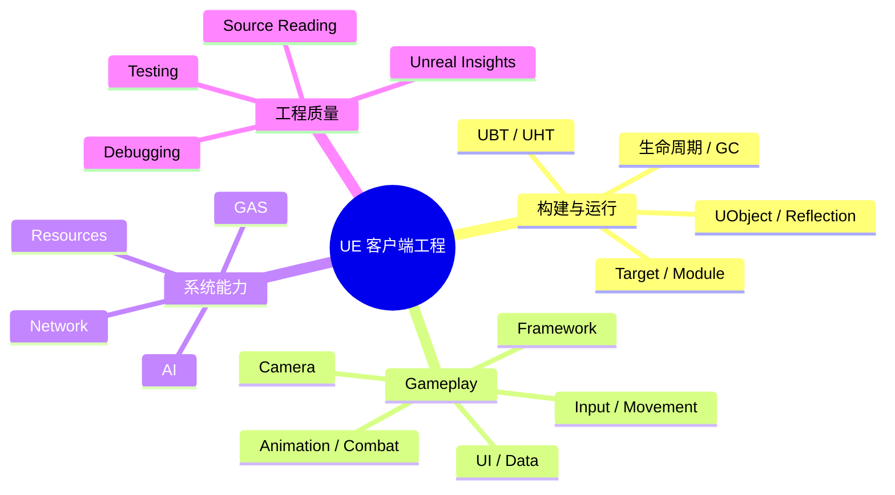

# UE 知识体系

本栏目用于沉淀跨课程 Day 可复用的 UE 机制说明。内容必须能够回到 Project Aegis 中的类、资产、日志或 Trace 证据。

## 知识地图

## 收录标准

- 不只解释 API 名称，还要说明生命周期、所有权、线程或网络边界。
- 至少包含一个 Project Aegis 中的实际落点。
- 明确适用的 UE 版本和已验证范围。
- 将事实、推断和待验证事项分开书写。
