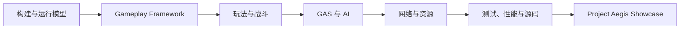

# UE 客户端工程

当前主线 · UE 5.8 · C++ · Project Aegis

本领域记录 UE 客户端岗位所需的构建系统、运行模型、Gameplay、GAS、AI、网络、资源、测试、性能和源码阅读能力。所有结论尽量关联 Project Aegis 中的代码、资产、日志、Trace 或演示证据。

## 最新学习日志

- [Day 10：GameMode 与 GameState 的权威边界](/journal/2026-08-12-ue-day10-gamemode-gamestate)
- [Day 09：GameInstance 与 Subsystem 生命周期](/journal/2026-07-28-ue-day09-gameinstance-subsystem)
- [Day 08：World、Level 与 PIE 多 World 启动链](/journal/2026-07-26-ue-day08-world-level-pie)
- [Day 07：Week 1 对象运行模型实验室整合与验证](/journal/2026-07-25-ue-day07-week1-object-runtime-lab)
- [Day 06：Delegate、Timer、日志与断言](/journal/2026-07-23-ue-day06-delegate-timer-logging-assertions)
- [Day 05：Actor 与 Component 生命周期](/journal/2026-07-22-ue-day05-actor-component-lifecycle)
- [Day 04：对象指针、Outer 与 GC 可达性](/journal/2026-07-19-ue-day04-object-pointers-gc)
- [Day 03：从 UObject 反射到 CDO 与默认值来源、GC](/journal/2026-07-18-ue-day03-uobject-reflection-cdo)
- [Day 02：从 AegisCore 模块到 UBT/UHT 与 Unity Build 边界](/journal/2026-07-17-ue-day02-ubt-uht-module-boundary)
- [Day 01：基于 Third Person 模板建立可恢复、可构建、可调试的 UE 5.8 C++ 工程基线](/journal/2026-07-14-ue-day01-engineering-baseline)

## 快速入口

  <a class="portfolio-card" href="/ue/showcase/">
    <h3>UE 面试展示</h3>
    
面向招聘人员的精选入口，只聚合 UE 能力、Project Aegis 和关键工程证据。

  </a>
  <a class="portfolio-card" href="/ue/project-aegis/">
    <h3>Project Aegis</h3>
    
贯穿 Gameplay、GAS、AI、网络、资源与性能的 UE 5.8 C++ 主项目。

  </a>
  <a class="portfolio-card" href="/ue/roadmap/">
    <h3>学习路线与进度</h3>
    
十二周能力主线、课程 Day 验收状态和长期交付目标。

  </a>
  <a class="portfolio-card" href="/ue/knowledge/">
    <h3>UE 知识体系</h3>
    
构建与运行、Gameplay、系统能力、工程质量和源码理解。

  </a>
  <a class="portfolio-card" href="/ue/engineering/debugging/">
    <h3>工程实践</h3>
    
系统设计、Bug 排障、Unreal Insights、测试与性能证据。

  </a>
  <a class="portfolio-card" href="/ue/source-reading/">
    <h3>源码阅读</h3>
    
从真实项目问题出发阅读 Lyra、GAS 和 UE 引擎调用链。

  </a>

## UE 能力形成路径

::: info AI 名称边界
本领域中的 UE AI 指 AIController、感知、行为树、EQS 和导航。机器学习、LLM、Agent 与 RAG 归入独立的 [AI / 机器学习与大模型](/ai/) 领域。
:::
