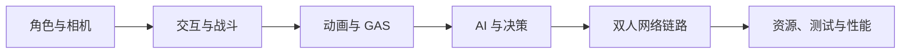

# Project Aegis

UE 5.8 · C++ · 持续演进

Project Aegis 是贯穿整个学习计划的第三人称动作客户端 Showcase。项目不会被拆成互不关联的教程 Demo，而是围绕同一个 Vertical Slice 持续增加 Gameplay、GAS、AI、网络、资源和性能能力。

## 当前已验证基线

- UE 5.8 C++ Third Person 工程可以启动并通过 PIE。
- Git LFS、忽略规则、私有仓库和干净 Clone 恢复链路已经验证。
- Development Editor 与 DebugGame Editor 均可构建运行。
- 项目模块 DLL/PDB 能够加载，`StartupModule()` 源码断点可命中。
- `AegisCore` Runtime 模块已建立，`ProjectAegis → AegisCore` 直接依赖与 Non-Unity 独立编译已经验证。
- 主分支保持可运行，当前开发仓库暂时私有。

## 目标能力

## 展示原则

- 功能有边界验证，而不是只展示正常路径。
- 架构决策能说明依赖、生命周期、网络和性能代价。
- 每个里程碑关联代码版本、测试结果和演示证据。
- 不公开许可不明确的 Marketplace、Fab、Epic 样例或第三方资产。
