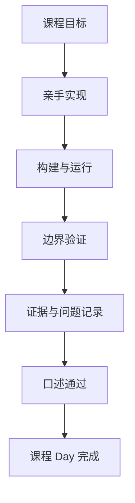

# 学习路线与进度

Day 02 已完成 · Day 03 尚未开始

## 长期目标

- 建立可解释、可运行、可复现、可测试、可展示的 UE C++ 客户端能力。
- 将 Project Aegis 做成贯穿 Gameplay、GAS、AI、网络、资源与性能的 Vertical Slice。
- 形成公开知识网站、演示证据、项目讲稿和面试复盘。

## 十二周能力主线

| 周次 | 主题 | 核心交付 |
|---|---|---|
| Week 1 | UE C++ 运行模型与工程入口 | 工程骨架、模块、反射、生命周期证据 |
| Week 2 | Gameplay Framework | 角色、控制器、模式、世界与组件职责 |
| Week 3 | 输入、移动与相机 | Enhanced Input、移动状态与相机系统 |
| Week 4 | UI 与数据 | UMG、数据资产、配置和状态展示 |
| Week 5 | 动画与战斗 | 动画状态、Montage、命中与伤害链路 |
| Week 6 | Gameplay 架构 | 交互、事件、模块边界与可测试性 |
| Week 7 | GAS | ASC、Attribute、Ability、Effect、Tag、Cue |
| Week 8 | AI | 感知、行为树、EQS、导航与性能预算 |
| Week 9 | 网络 | Authority、Ownership、RPC、复制与延迟测试 |
| Week 10 | 资源与发布 | 软引用、异步加载、Asset Manager、Cook、测试 |
| Week 11 | 性能与工具 | Unreal Insights、内存、加载、网络与优化 Sprint |
| Week 12 | 源码与作品集 | Lyra 阅读、重构、视频、简历与面试演练 |

## 进度原则

课程 Day 以验收完成为边界，而不是以自然日期为边界。跨日学习不会自动删减、跳过或合并 UE 核心内容。

