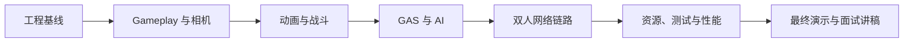

# UE 面试展示

面试官快速入口 · 内容随项目里程碑持续更新

本页只聚合 UE 客户端工程、Project Aegis 和相关工程证据，便于招聘人员沿一条路径快速查看。

## 个人能力概览

- 7 年以上 C++ 客户端开发经验；
- 有商业客户端与自研引擎开发背景；
- 当前使用 UE 5.8 和 C++ 开发 Project Aegis；
- 关注构建系统、生命周期、Gameplay、GAS、AI、网络、调试、测试和性能；
- 以可运行、可解释、可复现、可测试和可展示为验收标准。

## 主项目：Project Aegis

[Project Aegis](/ue/project-aegis/) 是一个持续演进的 UE 5.8 C++ 第三人称动作客户端 Showcase，不是互不关联的教程 Demo。

当前基线已经验证：

- C++ Third Person 工程、Editor 与 PIE；
- Git LFS、干净 Clone 和可恢复构建；
- Development Editor 与 DebugGame Editor；
- 项目模块 DLL/PDB、符号加载和源码断点；
- 模块 Startup/Shutdown 生命周期日志；
- `AegisCore` Runtime 模块、`ProjectAegis → AegisCore` 直接依赖和 Non-Unity 独立编译；
- `UAegisDeveloperSettings`、UHT 反射生成物、Config/蓝图默认值与四对象 CDO 实验；
- `TObjectPtr`、裸指针、`TWeakObjectPtr`、`TSoftObjectPtr`、Outer、Root 与 GC 可达性实验；
- `AAegisLifecycleProbe`、`UHealthComponent`、单次 Tick、运行时 Spawn 与多类 EndPlay 路径实验；
- Gameplay Framework 职责实例图、`ProjectAegisTests` Functional Test、Spawn/Possess 回归和全新 Clone 恢复验证；
- 主分支与远端同步、提交可回滚。

## 精选工程入口

| 能力 | 展示入口 | 当前状态 |
|---|---|---|
| 构建系统与运行模型 | [Day 02 UBT/UHT 与模块边界](/journal/2026-07-17-ue-day02-ubt-uht-module-boundary) / [Day 01 工程基线](/journal/2026-07-14-ue-day01-engineering-baseline) / [学习路线](/ue/roadmap/) | Day 01、Day 02 完整文章已发布 |
| UObject 与默认值模型 | [Day 03 UObject、反射与 CDO](/journal/2026-07-18-ue-day03-uobject-reflection-cdo) | 已验证原生/蓝图 CDO、Config、Class Defaults 与实例关系 |
| UObject 引用与 GC | [Day 04 对象指针、Outer 与 GC 可达性](/journal/2026-07-19-ue-day04-object-pointers-gc) | 已验证强/裸/弱/软引用、Outer、Root 与 GC 可达性 |
| Actor 与 Component 生命周期 | [Day 05 Actor 与 Component 生命周期](/journal/2026-07-22-ue-day05-actor-component-lifecycle) | 已验证 Construction、初始化、Tick、Spawn 与多类 EndPlay 路径 |
| 项目架构 | [系统设计](/ue/engineering/design/) | 随实现逐步形成 |
| 调试与排障 | [Bug 与排障](/ue/engineering/debugging/) | 已建立方法与证据规范 |
| 性能分析 | [Unreal Insights](/ue/engineering/performance/) | 待性能课程形成案例 |
| 源码深度 | [Lyra / GAS 源码阅读](/ue/source-reading/) | 待课程推进 |
| 演示证据 | [演示视频](/ue/videos/) | Day 01～Day 14 关键证据视频已嵌入文章 |
| 面试表达 | [UE 面试与项目复盘](/ue/interviews/) | 按课程持续积累 |

## 后续里程碑

## 联系方式

- GitHub：[JeromeJtw](https://github.com/JeromeJtw)
- 个人主页：[JeromeJtw · 知识与作品](/)

简历 PDF 和其他公开联系方式将在投递版本确认后加入。
